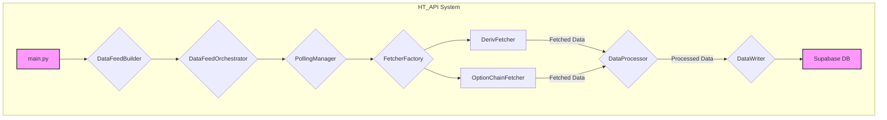

# HT_API - 한국투자증권 API 기반 실시간 데이터 시스템

## 📋 프로젝트 개요

**HT_API**는 한국투자증권(KIS) API를 활용하여 **선물 및 옵션 데이터를 실시간으로 수집, 처리하고 Supabase 데이터베이스에 저장**하는 시스템입니다. REST API를 통해 분봉 데이터를 안정적으로 수집하며, 매 분 정각에 모든 데이터를 동기화하여 정확성을 보장합니다. 수집된 데이터는 티커별로 자동 생성된 테이블에 저장되어 체계적인 관리가 가능합니다.

## ✨ 주요 기능

-   **실시간 데이터 수집**: KOSPI/KOSDAQ 선물 및 KOSPI200 옵션 체인 데이터 실시간 수집.
-   **동기화된 1분봉 폴링**: 매 분 정각(`+ polling_interval`초)에 모든 데이터를 동시에 요청하여 시간 오차 최소화.
-   **데이터 누락 방지**: API 서버 지연으로 인한 데이터 누락 발생 시, 자동으로 재시도하여 데이터 무결성 보장.
-   **동적 데이터베이스 관리**:
    -   선물 데이터는 `futures_101`, `futures_106`과 같이 티커별로 자동 생성된 테이블에 저장.
    -   옵션 매트릭스는 `option_matrices_202509_kospi200`과 같이 만기별로 자동 생성된 테이블에 저장.
-   **Supabase 실시간 연동**: 수집된 모든 데이터를 실시간으로 Supabase PostgreSQL 데이터베이스에 저장.
-   **한국 시간(KST) 기준 저장**: 모든 타임스탬프는 한국 시간대(`Asia/Seoul`) 기준으로 정확히 기록.

## 🏗️ 시스템 아키텍처



### 🔄 데이터 흐름

1.  **`main.py`**: 시스템 시작, 데이터 구독 설정 및 `DataFeedOrchestrator` 생성.
2.  **`DataFeedOrchestrator`**: 전체 데이터 수집 파이프라인을 조율.
3.  **`PollingManager`**: 매 분 정각(+ 설정된 버퍼 시간)에 모든 `Fetcher`를 동시에 실행하여 데이터 요청 동기화.
4.  **`Fetcher` (선물/옵션)**: KIS API를 호출하여 원본 데이터를 가져옴.
5.  **`DataProcessor`**: `Fetcher`가 수집한 데이터를 `DataWriter`로 전달. 옵션 데이터의 경우, `OptionMatrixProcessor`를 통해 매트릭스 형태로 가공.
6.  **`DataWriter`**:
    -   전달받은 데이터를 기반으로 Supabase에 필요한 테이블(`futures_*`, `option_matrices_*`)이 존재하는지 확인하고, 없으면 **동적으로 생성**.
    -   가공된 데이터를 실시간으로 Supabase 테이블에 저장(UPSERT).
7.  **`Supabase DB`**: 모든 데이터가 한국 시간(KST) 기준으로 영구 저장됨.

## 🔧 설정 및 실행

### 1. 설정 파일

#### `config.json` (API 및 폴링 설정)

```json
{
  "app_key": "YOUR_APP_KEY",
  "app_secret": "YOUR_APP_SECRET",
  "base_url": "https://openapi.koreainvestment.com:9443",
  "account_no": "YOUR_ACCOUNT_NUMBER",
  "account_no_sub": "01",
  "polling_interval": 2,
  "tr_id": {
    "deriv_minute": "FHKIF03020200",
    "option_chain": "FHPIF05030100"
  }
}
```

-   `polling_interval`: 매 분 정각 이후 데이터 요청을 시작하기까지의 대기 시간(초). API 서버가 데이터를 준비할 시간을 확보해 데이터 누락을 방지합니다.

#### `db_config.json` (데이터베이스 설정)

```json
{
  "database": {
    "supabase_url": "YOUR_SUPABASE_URL",
    "supabase_key": "YOUR_SUPABASE_KEY",
    "postgres_url": "YOUR_SUPABASE_POSTGRES_CONNECTION_STRING"
  }
}
```

-   **중요**: `postgres_url`의 비밀번호에 특수문자가 포함된 경우, 반드시 **URL 인코딩**된 값으로 입력해야 합니다. (예: `!` -> `%21`)

### 2. 실행

프로젝트 루트 디렉토리에서 아래 명령어를 실행합니다.

```bash
run.bat
```

또는

```bash
python src/main.py
```

## 🗂️ 데이터베이스 스키마

### `futures_{ticker_prefix}` (예: `futures_101`)

| 컬럼명    | 타입        | 설명                 |
| :-------- | :---------- | :------------------- |
| `id`      | `SERIAL`    | 기본 키              |
| `timestamp` | `TIMESTAMPTZ` | 캔들 시간 (KST)    |
| `symbol`  | `VARCHAR(20)` | 선물 종목 코드     |
| `open`    | `NUMERIC`   | 시가                 |
| `high`    | `NUMERIC`   | 고가                 |
| `low`     | `NUMERIC`   | 저가                 |
| `close`   | `NUMERIC`   | 종가                 |
| `volume`  | `BIGINT`    | 거래량               |

### `option_matrices_{maturity}_{name}` (예: `option_matrices_202509_kospi200`)

| 컬럼명             | 타입        | 설명                               |
| :----------------- | :---------- | :--------------------------------- |
| `id`               | `SERIAL`    | 기본 키                            |
| `timestamp`        | `TIMESTAMPTZ` | 옵션 체인 시간 (KST)               |
| `underlying_symbol` | `VARCHAR(50)` | 기초자산 심볼 (예: `202509_KOSPI200`) |
| `metric_type`      | `VARCHAR(20)` | 지표 종류 (iv, delta, price 등)    |
| `c_itm10` ~ `p_otm10` | `NUMERIC`   | 등가(ATM) 기준 각 행사가의 지표 값  |

---
이 문서는 HT_API 시스템의 전체 구조와 핵심 기능을 상세히 설명하여, 시스템을 이해하고 확장하는 데 도움이 되도록 작성되었습니다.